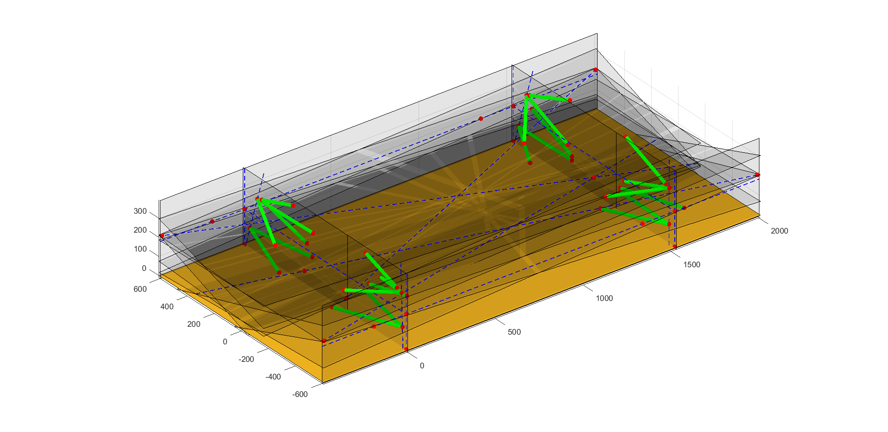

# OpenSus
A relatively basic set of Matlab scripts for kinematic analysis of suspension systems

## Dependencies
If you don't already have the Geom2d and Geom3d toolboxes installed then run `setup.m`.

**DISCLAIMER:** I haven't had the time to do much work on taking this from a proof of concept to a user-oriented set of tools yet so for now it remains a collection of example scripts that you may find useful.
